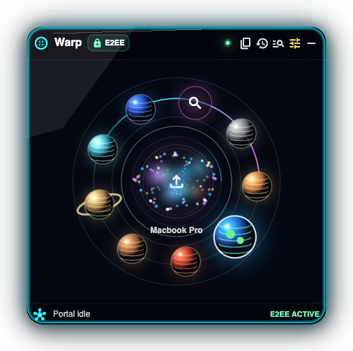
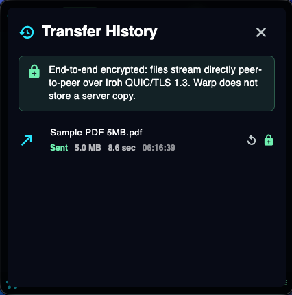

# Clever Code — Portfolio Website

Personal portfolio website for Murtuza Masalawala / Clever Code.  
Live at: **https://clevercode.au**

---

## Folder Structure

```
clevercode/
├── index.html          ← Main website (single page)
├── projects.json       ← All projects/apps data — edit this to add new projects
├── css/
│   └── style.css       ← All styles
├── js/
│   └── main.js         ← JavaScript (navigation, project rendering, form)
├── images/             ← Images folder
│   ├── warp/           ← Warp screenshots (add here)
│   └── projects/       ← Project screenshots (add here)
├── resume/
│   └── resume.pdf      ← ⭐ ADD YOUR RESUME PDF HERE
└── README.md           ← This file
```

---

## 🚀 Deploy to GitHub Pages

### First-time setup

1. **Create a repository** named `clevercode.au` (or your username.github.io) on GitHub
2. Upload all files to the repository root
3. Go to **Settings → Pages**
4. Set source to **"Deploy from branch"**, branch **main**, folder **/ (root)**
5. Click **Save** — your site will be live within a minute or two

### Custom domain (clevercode.au)

1. In **Settings → Pages**, enter `clevercode.au` under "Custom domain"
2. Create a file named `CNAME` in the repo root containing just:
   ```
   clevercode.au
   ```
3. At your domain registrar (GoDaddy, Namecheap, etc.), add these DNS records:
   ```
   A     @    185.199.108.153
   A     @    185.199.109.153
   A     @    185.199.110.153
   A     @    185.199.111.153
   CNAME www  yourusername.github.io.
   ```
4. Wait 10–30 minutes for DNS propagation

### Updating the site

```bash
# Edit files locally, then:
git add .
git commit -m "Update site"
git push

# GitHub Pages auto-deploys within ~1 minute
```

---

## ⭐ Adding Your Resume

1. Save your resume as a PDF named `resume.pdf`
2. Place it in the `resume/` folder
3. Commit and push — the "Download Resume" and "View Resume" buttons will work immediately

---

## ➕ Adding a New Project or App

Open `projects.json` and add a new entry to the array. Copy this template:

```json
{
  "id": "my-new-project",
  "name": "My New Project",
  "tagline": "One-line description of what it does",
  "description": "2-3 sentence description shown on the card.",
  "category": "Web App",
  "status": "In Progress",
  "github": "https://github.com/mfmgold/my-repo",
  "demo": "https://myapp.example.com",
  "download": "",
  "image": "images/projects/my-project.png",
  "featured": false,
  "features": [],
  "roadmap": []
}
```

### Category options (controls badge colour):
- `"Flutter"` — blue badge
- `"AI"` — purple badge
- `"RPA"` — amber badge
- `"Web App"` — green badge
- `"Automation"` — red badge

### Status options (controls status dot):
- `"Live"` — green pulsing dot
- `"In Progress"` — amber pulsing dot
- `"MVP"` — blue dot
- `"Archived"` — grey dot

### Fields:
| Field | Required | Notes |
|-------|----------|-------|
| `id` | ✅ | Unique slug, no spaces |
| `name` | ✅ | Display name |
| `tagline` | ✅ | Short one-liner |
| `description` | ✅ | Card body text |
| `category` | ✅ | See options above |
| `status` | ✅ | See options above |
| `github` | optional | Link to repo |
| `demo` | optional | Link to live demo |
| `download` | optional | Download link |
| `image` | optional | Path to screenshot (leave `""` for icon) |
| `featured` | optional | Set `true` to exclude from main grid (used for Warp) |
| `features` | optional | Array of feature strings (used in Warp section) |
| `roadmap` | optional | Array of roadmap items (used in Warp section) |

---

## 🔧 Updating the Warp Section

Find the `"id": "warp"` entry in `projects.json`.

- Update `features` array to change the features list
- Update `roadmap` array to change the roadmap — each item has:
  - `phase` — e.g. "Phase 1"
  - `title` — e.g. "Core UI & Navigation"
  - `status` — `"complete"`, `"in-progress"`, or `"upcoming"`

### Adding Warp screenshots:
1. Save screenshots to `images/warp/`
2. In `index.html`, find the Warp screenshot placeholder block (search for `"Screenshots coming soon"`)
3. Replace it with an `` or a grid of images, e.g.:
```html
<div style="display:grid;grid-template-columns:1fr 1fr;gap:16px;margin-top:40px;">
  
  
</div>
```

---

## 📬 Setting Up the Contact Form

The form is pre-wired for **Formspree** (free tier: 50 messages/month).

1. Go to https://formspree.io and create a free account
2. Create a new form → you'll get an endpoint like `https://formspree.io/f/abcdefgh`
3. Open `js/main.js`, find this line:
   ```js
   const FORM_ENDPOINT = 'https://formspree.io/f/YOUR_FORM_ID';
   ```
4. Replace `YOUR_FORM_ID` with your actual form ID

Alternatively, replace the `<form>` in `index.html` with a mailto link or any other form service.

---

## 📧 Email Address

Update your email address in two places in `index.html`:

Search for `hello@clevercode.au` and replace with your actual email address.

---

## 🎨 Customising Colours & Fonts

Open `css/style.css` and edit the `:root` variables at the top:

```css
:root {
  --accent: #e8a227;   /* Change this for a different accent colour */
  --bg:     #0d1117;   /* Main background */
  --bg-2:   #161b22;   /* Section alt background */
  /* ... */
}
```

Fonts are loaded from Google Fonts. To change them, update the `@import` line at the top of `style.css`.

---

## 🏷️ SEO — Update Meta Tags

In `index.html`, update these tags in the `<head>`:

```html
<meta name="description" content="Your description here" />
<meta property="og:title" content="Your Name — Your Title" />
<meta property="og:description" content="Your description here" />
<meta property="og:url" content="https://clevercode.au" />
```

---

## Need Help?

Questions? Open an issue on the GitHub repo or refer to:
- [GitHub Pages docs](https://docs.github.com/en/pages)
- [Formspree docs](https://help.formspree.io)
